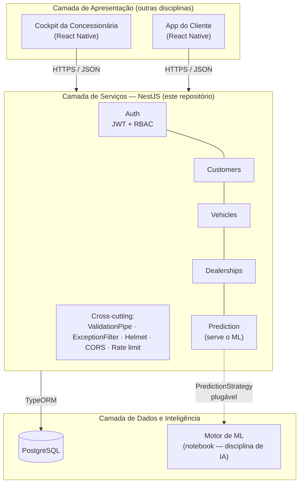

# Ford Conecta — Camada de Serviços (Web Services)

API REST da plataforma **Ford Conecta**, desenvolvida para o **Desafio 02 — Ford FIAP 2026**
(disciplina *Arquitetura Orientada a Serviços e Web Services*).

O objetivo de negócio é aumentar o **VIN Share** da Ford — a porcentagem de veículos que
usam a rede oficial para manutenção — por meio de um ciclo de retenção pós-venda preditivo.
Esta camada é o **back-end** que sustenta o Cockpit da Concessionária, o App do Cliente e o
Motor de ML.

---

## Equipe

| Integrante | RM |
|---|---|
| Arthur Abonizio | 555506 |
| Gabriel Padula | 554907 |
| Rodrigo Nakata | 556417 |

**Turma:** _(preencher)_  ·  **Disciplina:** Arquitetura Orientada a Serviços e Web Services  ·  **Desafio 02 — Ford FIAP 2026**

---

## 1. Arquitetura

A solução segue uma arquitetura **em camadas** com **serviços SOA** independentes e reutilizáveis.



**Separação de camadas (dentro do back-end):**

| Camada | Responsabilidade | Implementação |
|---|---|---|
| Apresentação (borda HTTP) | Receber requests, validar, formatar respostas | **Controllers** + DTOs + Pipes |
| Serviço (regra de negócio) | Orquestração e lógica de domínio | **Services** |
| Dados | Persistência | **Entities** + Repositories (TypeORM) + **migrations** |

Cada pasta em `src/modules/*` é um **serviço SOA** autocontido (módulo Nest com seu próprio
controller, service, DTOs e entidade) e reutilizável — ex.: `VehiclesService` reusa
`CustomersService` e `DealershipsService` para validar integridade.

---

## 2. Stack

- **Node.js + TypeScript**
- **NestJS 11** (framework modular)
- **TypeORM 0.3** + **PostgreSQL 16** (com **migrations** versionadas)
- **JWT** (`@nestjs/jwt` + Passport) + **RBAC**
- **Swagger / OpenAPI** (`@nestjs/swagger`) como contrato dos endpoints
- **class-validator** (validação/sanitização de entrada)
- **Helmet**, **CORS** restrito, **rate limiting** (`@nestjs/throttler`)
- **Docker Compose** (Postgres)

---

## 3. Estrutura de pastas

```
src/
├── main.ts                      # bootstrap: Swagger, Helmet, CORS, ValidationPipe, ExceptionFilter
├── app.module.ts                # composição dos módulos + TypeORM + Throttler
├── config/
│   ├── database.config.ts       # opções de conexão (fonte única)
│   └── data-source.ts           # DataSource para a CLI de migrations
├── common/
│   ├── entities/base.entity.ts  # id UUID + timestamps
│   ├── dto/pagination-query.dto.ts
│   ├── filters/all-exceptions.filter.ts  # formato único de erro
│   └── utils/xml.util.ts        # serialização XML
├── health/                      # GET /health (status + db)
├── database/
│   ├── migrations/              # migrations versionadas
│   └── seed.ts                  # dados iniciais
└── modules/                     # SERVIÇOS SOA
    ├── auth/                    # register, login (JWT), me, users + guards/RBAC
    ├── customers/               # CRUD de clientes
    ├── vehicles/                # CRUD de veículos (+ ficha XML)
    ├── dealerships/             # concessionárias
    └── prediction/              # predição de perfil + risco (Strategy plugável)
```

---

## 4. Como rodar

**Pré-requisitos:** Node.js 20+, Docker Desktop.

```bash
# 1. Subir o PostgreSQL
npm run db:up

# 2. Instalar dependências
npm install

# 3. Criar as tabelas (migrations)
npm run migration:run

# 4. Popular dados de exemplo (idempotente)
npm run seed

# 5. Subir a API
npm run start:dev
```

- API: **http://localhost:3000/api**
- Swagger (contrato): **http://localhost:3000/docs**
- Health: **http://localhost:3000/health**

> Sem Docker? Aponte o `.env` para um Postgres gerenciado (ex.: Neon/Supabase) trocando as
> variáveis `DB_*` — o restante do fluxo é idêntico.

---

## 5. Variáveis de ambiente

Copie `.env.example` para `.env`. Principais:

| Variável | Descrição | Default |
|---|---|---|
| `PORT` | Porta da API | `3000` |
| `DB_HOST` / `DB_PORT` / `DB_USER` / `DB_PASSWORD` / `DB_NAME` | Conexão Postgres | `localhost` / `5432` / `ford` / `ford_secret` / `ford_conecta` |
| `JWT_SECRET` | Segredo de assinatura do JWT | *(troque em produção)* |
| `JWT_EXPIRES_IN` | Expiração do token | `3600s` |
| `CORS_ORIGINS` | Origens autorizadas (CSV) | localhost dev |
| `THROTTLE_TTL` / `THROTTLE_LIMIT` | Janela e limite de rate limiting | `60000` / `120` |

---

## 6. Autenticação e papéis (RBAC)

Autenticação via **JWT Bearer**. Três papéis: `admin`, `analyst` (pós-venda/Cockpit) e
`customer` (App do Cliente).

**Credenciais criadas pelo seed:**

| Papel | E-mail | Senha |
|---|---|---|
| admin | `admin@fordconecta.com` | `Admin@12345` |
| analyst | `analista@fordconecta.com` | `Analyst@12345` |

```bash
# Login -> copie o accessToken
curl -X POST http://localhost:3000/api/auth/login \
  -H 'Content-Type: application/json' \
  -d '{"email":"admin@fordconecta.com","password":"Admin@12345"}'

# Use nos endpoints protegidos:
curl http://localhost:3000/api/customers -H "Authorization: Bearer <TOKEN>"
```

---

## 7. Endpoints

Base: `/api` (exceto `/health`). 🔒 = requer JWT.

### Auth
| Método | Rota | Acesso | Descrição |
|---|---|---|---|
| `POST` | `/auth/register` | público | Auto-cadastro (papel `customer`) |
| `POST` | `/auth/login` | público | Retorna JWT |
| `GET` | `/auth/me` | 🔒 qualquer | Perfil do usuário autenticado |
| `GET` | `/auth/users` | 🔒 admin | Lista usuários |

### Customers
| Método | Rota | Acesso | Descrição |
|---|---|---|---|
| `POST` | `/customers` | 🔒 admin, analyst | Cria cliente |
| `GET` | `/customers` | 🔒 qualquer | Lista (paginado) |
| `GET` | `/customers/:id` | 🔒 qualquer | Detalha (com veículos) |
| `PUT` | `/customers/:id` | 🔒 admin, analyst | Atualiza |
| `DELETE` | `/customers/:id` | 🔒 admin | Remove |

### Vehicles
| Método | Rota | Acesso | Descrição |
|---|---|---|---|
| `POST` | `/vehicles` | 🔒 admin, analyst | Cadastra veículo |
| `GET` | `/vehicles` | 🔒 qualquer | Lista (paginado) |
| `GET` | `/vehicles/customer/:customerId` | 🔒 qualquer | Veículos de um cliente |
| `GET` | `/vehicles/:id` | 🔒 qualquer | Detalha (JSON) |
| `GET` | `/vehicles/:id/xml` | 🔒 qualquer | Ficha técnica em **XML** |
| `PUT` | `/vehicles/:id` | 🔒 admin, analyst | Atualiza |
| `DELETE` | `/vehicles/:id` | 🔒 admin | Remove |

### Dealerships
| Método | Rota | Acesso | Descrição |
|---|---|---|---|
| `POST` | `/dealerships` | 🔒 admin | Cria concessionária |
| `GET` | `/dealerships` | 🔒 qualquer | Lista |
| `GET` | `/dealerships/:id` | 🔒 qualquer | Detalha |

### Predictions
| Método | Rota | Acesso | Descrição |
|---|---|---|---|
| `POST` | `/predictions` | 🔒 admin, analyst | Gera perfil + risco de evasão + ação recomendada |
| `GET` | `/predictions` | 🔒 admin, analyst | **Lista de risco** (ordenada por maior risco) |
| `GET` | `/predictions/customer/:customerId` | 🔒 admin, analyst | Histórico de predições do cliente |

### Health
| Método | Rota | Descrição |
|---|---|---|
| `GET` | `/health` | Status da API + conectividade com o banco |

---

## 8. Convenções HTTP

| Método | Uso |
|---|---|
| `GET` | Leitura (idempotente) |
| `POST` | Criação / ações que geram recurso |
| `PUT` | Atualização |
| `DELETE` | Remoção |

| Status | Quando |
|---|---|
| `200 OK` | Leitura/atualização com sucesso |
| `201 Created` | Recurso criado |
| `204 No Content` | Remoção com sucesso |
| `400 Bad Request` | Validação de entrada falhou / UUID inválido |
| `401 Unauthorized` | Token ausente/ inválido |
| `403 Forbidden` | Papel sem permissão (RBAC) |
| `404 Not Found` | Recurso inexistente |
| `409 Conflict` | Violação de unicidade (CPF, VIN, e-mail) |
| `429 Too Many Requests` | Rate limit excedido |

---

## 9. Formato padronizado de erro

Todas as exceções passam por um **filtro global** e retornam o mesmo envelope JSON. **Stack
traces e detalhes internos nunca são expostos** (logados apenas no servidor):

```json
{
  "statusCode": 404,
  "error": "Not Found",
  "message": "Cliente não encontrado",
  "path": "/api/customers/00000000-0000-0000-0000-000000000000",
  "timestamp": "2026-05-23T20:23:40.468Z"
}
```

Erros de validação trazem a lista de problemas em `message`:

```json
{
  "statusCode": 400,
  "error": "Bad Request",
  "message": ["document deve conter 11 dígitos numéricos", "email must be an email"],
  "path": "/api/customers",
  "timestamp": "..."
}
```

---

## 10. Banco de dados e migrations

Conexão configurada em [`src/config/database.config.ts`](src/config/database.config.ts)
(fonte única, reutilizada pela app e pela CLI). **Não usamos `synchronize`** — o schema é
controlado por **migrations versionadas**.

```bash
npm run migration:generate   # gera migration a partir do diff das entidades
npm run migration:run        # aplica migrations pendentes
npm run migration:revert     # reverte a última
```

---

## 11. Predição e integração com o Motor de ML

A API de predição classifica o cliente em um dos quatro perfis hipotetizados
(`fiel`, `abandono`, `esquecido`, `economico`) e estima o **risco de evasão**, usando
**apenas features do momento da compra**.

> **Regra crítica respeitada:** nenhuma variável de comportamento futuro (revisões, gastos,
> hodômetro pós-compra) é usada na predição — isso evita *data leakage*, conforme o enunciado
> de ML.

A lógica fica atrás da interface **`PredictionStrategy`** (padrão Strategy). Hoje há uma
implementação **heurística transparente** (`heuristic-v1`); para plugar o modelo treinado do
notebook, basta criar uma nova estratégia e trocar **uma linha** no
[`prediction.module.ts`](src/modules/prediction/prediction.module.ts) — controllers e services
não mudam.

---

## 12. Segurança (camada transversal)

- **JWT** assinado e expirável + **RBAC** por papéis.
- **Validação e sanitização** de toda entrada (`whitelist` + `forbidNonWhitelisted`).
- **Helmet** (CSP, HSTS, X-Content-Type-Options...), **CORS** restrito por origem.
- **Rate limiting / throttling** global.
- **Erros sem stack trace**; senhas com **hash bcrypt** e nunca retornadas.

---

## 13. Cobertura do rubric da disciplina

| Critério (peso) | Onde está |
|---|---|
| Desenho da arquitetura (10%) | Seção 1 (diagrama Mermaid) + estrutura em camadas |
| APIs RESTful (20%) | 5 módulos / 23 rotas (`src/modules/*`) |
| Métodos HTTP adequados (10%) | Seção 8 + controllers |
| Documentação (Swagger/README) (10%) | `/docs` + este README |
| Serviços modulares/reutilizáveis — SOA (10%) | Módulos Nest independentes; reuso de services |
| Separação de camadas (10%) | Controller → Service → Entity/Repository |
| Padrões REST/JSON/XML (8%) | JSON em toda a API + XML em `/vehicles/:id/xml` |
| Tratamento de erros (7%) | Filtro global (Seção 9) |
| Conexão ao banco (8%) | `database.config.ts` + `.env` + Docker |
| Controle de migrações (7%) | TypeORM migrations (Seção 10) |

---

## 14. Roadmap (próximas sprints)

- Estratégia de predição que carrega o modelo de ML treinado (substituindo a heurística).
- Módulo **Leads** (fecha o ciclo: predição → lead → ação no App → agendamento → realimenta o ML).
- Notificações (push) para o App do Cliente.
- Auditoria estruturada de ações críticas.
