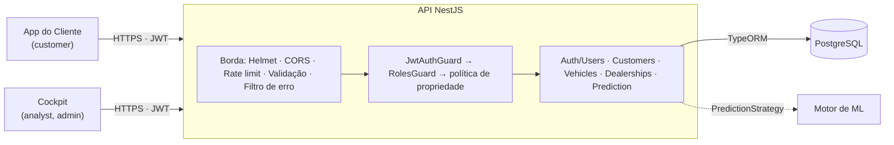

# Ford Conecta — Camada de Serviços (Web Services)

API REST da plataforma **Ford Conecta**, desenvolvida para o **Desafio 02 — Ford FIAP 2026**
(disciplina *Arquitetura Orientada a Serviços e Web Services*, Sprint 3).

O objetivo de negócio é aumentar o **VIN Share** da Ford, que é a porcentagem de veículos que
usam a rede oficial para manutenção, com um ciclo de retenção pós-venda preditivo. Esta camada
é o back-end que atende o App do Cliente, o Cockpit da Concessionária e o Motor de ML.

---

## Equipe

| Integrante | RM |
|---|---|
| Arthur Abonizio | 555506 |
| Gabriel Padula | 554907 |
| Rodrigo Nakata | 556417 |

---

## Onde está cada critério da Sprint 3

| Critério (peso) | O que foi feito | Onde ver |
|---|---|---|
| **Arquitetura da solução** (20%) | Diagrama de componentes, camadas por serviço, caminho da requisição, fluxos de login e de requisição protegida, modelo de dados | [`docs/ARQUITETURA.md`](docs/ARQUITETURA.md) e os PNGs em [`docs/diagramas/`](docs/diagramas) |
| **Autenticação e autorização** (20%) | Rotas públicas e protegidas; 3 perfis (`admin`, `analyst`, `customer`); autorização por papel e por propriedade do recurso (o customer só vê os próprios dados) | [Seção 5](#5-autenticação-e-perfis) · [matriz de permissões](docs/ARQUITETURA.md#5-autorização-perfis-e-permissões) · [`test/authorization.e2e-spec.ts`](test/authorization.e2e-spec.ts) |
| **JWT** (15%) | HS256 com algoritmo fixo, `iss`/`aud`, expiração de 1h, segredo obrigatório, revalidação do usuário a cada requisição | [Seção 5.2](#52-o-token-jwt) · [`src/config/jwt.config.ts`](src/config/jwt.config.ts) · [`test/jwt.e2e-spec.ts`](test/jwt.e2e-spec.ts) |
| **Maturidade REST nível 2** (20%) | Recursos e sub-recursos, `GET`/`POST`/`PATCH`/`DELETE`, `201` + `Location`, `204`, negociação de conteúdo JSON/XML com `406` | [Seções 6 e 7](#6-endpoints) · testes em [`test/`](test) |
| **Testes automatizados** (15%) | **146 testes** (36 de unidade + 110 e2e contra Postgres real) cobrindo sucesso, erro, 401 e 403; **98% de cobertura** | [Seção 9](#9-testes-automatizados) · [`docs/evidencias/`](docs/evidencias) |
| **Documentação e erros** (10%) | Swagger/OpenAPI com schemas de entrada, saída e erro; envelope único de erro; este README | `/docs` · [`docs/openapi.json`](docs/openapi.json) · [Seção 8](#8-formato-padronizado-de-erro) |

---

## 1. Arquitetura (resumo)



Cada pasta em `src/modules/*` é um serviço autocontido com três camadas: **Controller** (HTTP)
→ **Service** (regra de negócio) → **Repository/Entity** (dados). O detalhamento, com os
diagramas de sequência de autenticação, está em [`docs/ARQUITETURA.md`](docs/ARQUITETURA.md).

---

## 2. Stack

- **Node.js 20+** com **TypeScript**
- **NestJS 11**
- **TypeORM 0.3** + **PostgreSQL 16**, com **migrations** versionadas
- **JWT** (`@nestjs/jwt` + Passport) e **RBAC**
- **Swagger / OpenAPI 3** (`@nestjs/swagger`)
- **class-validator** para validar e sanitizar a entrada
- **Helmet**, **CORS** restrito e **rate limiting** (`@nestjs/throttler`)
- **Jest** + **Supertest** nos testes
- **Docker Compose** para o Postgres

---

## 3. Como rodar

**Pré-requisitos:** Node.js 20+ e Docker Desktop.

```bash
cp .env.example .env          # 1. variáveis de ambiente
npm run db:up                 # 2. sobe o PostgreSQL
npm install                   # 3. dependências
npm run migration:run         # 4. cria as tabelas
npm run seed                  # 5. dados de exemplo (idempotente)
npm run start:dev             # 6. sobe a API
```

- API: **http://localhost:3000/api**
- Swagger: **http://localhost:3000/docs**
- Health: **http://localhost:3000/health**

A coleção [`requests.http`](requests.http) (extensão REST Client do VS Code) percorre os fluxos
principais e os casos de erro, na ordem.

---

## 4. Variáveis de ambiente

| Variável | Descrição | Padrão |
|---|---|---|
| `PORT` | Porta da API | `3000` |
| `DB_HOST` · `DB_PORT` · `DB_USER` · `DB_PASSWORD` · `DB_NAME` | Conexão Postgres | `localhost` · `5432` · `ford` · `ford_secret` · `ford_conecta` |
| `JWT_SECRET` | Segredo de assinatura. **Obrigatório, mínimo de 32 caracteres**; a API não sobe sem ele | — |
| `JWT_EXPIRES_IN` | Validade do token, em segundos | `3600` |
| `JWT_ISSUER` · `JWT_AUDIENCE` | Claims `iss` e `aud` emitidas e validadas | `ford-conecta-api` · `ford-conecta-clients` |
| `CORS_ORIGINS` | Origens autorizadas (separadas por vírgula) | localhost |
| `THROTTLE_TTL` · `THROTTLE_LIMIT` | Rate limit global (janela em ms, requisições) | `60000` · `120` |
| `LOGIN_THROTTLE_TTL` · `LOGIN_THROTTLE_LIMIT` | Rate limit de login e cadastro | `60000` · `5` |
| `DB_NAME_TEST` | Banco usado pelos testes e2e | `ford_conecta_test` |

---

## 5. Autenticação e perfis

A autenticação é por **JWT Bearer**. Rotas públicas: `GET /health`, `POST /api/auth/register` e
`POST /api/auth/login`. Todas as outras exigem token.

| Papel | Quem é | Acesso |
|---|---|---|
| `admin` | Administrador da plataforma | Tudo, inclusive a gestão de usuários |
| `analyst` | Pós-venda da concessionária (Cockpit) | Carteira de clientes, veículos e predições; não remove nem administra usuários |
| `customer` | Dono do veículo (App) | Só o próprio cadastro e os próprios veículos |

**Usuários criados pelo seed:**

| Papel | E-mail | Senha |
|---|---|---|
| admin | `admin@fordconecta.com` | `Admin@12345` |
| analyst | `analista@fordconecta.com` | `Analyst@12345` |
| customer | `joao@example.com` | `Cliente@12345` |

```bash
# Login: copie o accessToken
curl -X POST http://localhost:3000/api/auth/login \
  -H 'Content-Type: application/json' \
  -d '{"email":"joao@example.com","password":"Cliente@12345"}'

# O dono do veículo vê o próprio cadastro...
curl http://localhost:3000/api/customers/me -H "Authorization: Bearer <TOKEN>"
# ...mas não a lista de clientes (403)
curl http://localhost:3000/api/customers -H "Authorization: Bearer <TOKEN>"
```

### 5.1 Autorização

- **Por papel:** `@Roles()` na rota, aplicado pelo `RolesGuard`.
- **Por propriedade:** um customer que troca o id na URL para o de outro cliente recebe `403`
  (proteção contra BOLA, OWASP API1).

A matriz completa de papel × rota está em
[`docs/ARQUITETURA.md`](docs/ARQUITETURA.md#5-autorização-perfis-e-permissões), e cada linha dela
é um teste.

O auto-cadastro cria um `customer` **sem vínculo**. Quem liga a conta ao cadastro de cliente é
um admin, com `PATCH /api/users/:id {"customerId": "..."}`. O vínculo não é automático por
e-mail porque o e-mail do cadastro não é verificado.

### 5.2 O token JWT

- **Assinado em HS256**, e a verificação só aceita HS256 (bloqueia `alg: none`).
- **Claims:** `sub` (usuário), `role`, `cid` (cliente vinculado), `iat`, `exp`, `iss`, `aud`.
  Nenhum dado pessoal.
- **Validade de 1 hora.** O login devolve `expiresIn: 3600` (segundos).
- **Validação:** assinatura, expiração, emissor e audiência. Depois disso, o usuário é relido do
  banco: se foi removido o token para de valer, e uma troca de papel vale na hora.
- **Segredo** vem só do ambiente, sem valor padrão no código, com mínimo de 32 caracteres.

---

## 6. Endpoints

Base: `/api` (exceto `/health`). 🔓 = público · 🔒 = exige JWT.

### Auth e usuários
| Método | Rota | Acesso | Resposta |
|---|---|---|---|
| `POST` | `/auth/register` | 🔓 | `201` perfil criado (papel customer) |
| `POST` | `/auth/login` | 🔓 | `200` token |
| `GET` | `/auth/me` | 🔒 qualquer | `200` perfil autenticado |
| `GET` | `/users` | 🔒 admin | `200` página de usuários |
| `GET` | `/users/:id` | 🔒 admin | `200` usuário |
| `PATCH` | `/users/:id` | 🔒 admin | `200` papel e/ou cliente vinculado alterados |

### Customers
| Método | Rota | Acesso | Resposta |
|---|---|---|---|
| `POST` | `/customers` | 🔒 admin, analyst | `201` + `Location` |
| `GET` | `/customers` | 🔒 admin, analyst | `200` página |
| `GET` | `/customers/me` | 🔒 customer | `200` o próprio cadastro |
| `GET` | `/customers/:id` | 🔒 admin, analyst, customer dono | `200` cliente com veículos |
| `PATCH` | `/customers/:id` | 🔒 admin, analyst | `200` atualização parcial |
| `DELETE` | `/customers/:id` | 🔒 admin | `204` |
| `GET` | `/customers/:id/vehicles` | 🔒 admin, analyst, customer dono | `200` veículos do cliente |
| `GET` | `/customers/:id/predictions` | 🔒 admin, analyst | `200` histórico de predições |

### Vehicles
| Método | Rota | Acesso | Resposta |
|---|---|---|---|
| `POST` | `/vehicles` | 🔒 admin, analyst | `201` + `Location` |
| `GET` | `/vehicles` | 🔒 admin, analyst | `200` página |
| `GET` | `/vehicles/:id` | 🔒 admin, analyst, customer dono | `200` em **JSON** (padrão) ou **XML** (`Accept: application/xml`); `406` para outro formato |
| `PATCH` | `/vehicles/:id` | 🔒 admin, analyst | `200` |
| `DELETE` | `/vehicles/:id` | 🔒 admin | `204` |

### Dealerships
| Método | Rota | Acesso | Resposta |
|---|---|---|---|
| `POST` | `/dealerships` | 🔒 admin | `201` + `Location` |
| `GET` | `/dealerships` | 🔒 qualquer | `200` lista |
| `GET` | `/dealerships/:id` | 🔒 qualquer | `200` |
| `PATCH` | `/dealerships/:id` | 🔒 admin | `200` |
| `DELETE` | `/dealerships/:id` | 🔒 admin | `204` |

### Predictions
| Método | Rota | Acesso | Resposta |
|---|---|---|---|
| `POST` | `/predictions` | 🔒 admin, analyst | `201` + `Location`: perfil, risco de evasão e ação recomendada |
| `GET` | `/predictions` | 🔒 admin, analyst | `200` lista de risco, do maior risco para o menor |
| `GET` | `/predictions/:id` | 🔒 admin, analyst | `200` |

### Health
| Método | Rota | Resposta |
|---|---|---|
| `GET` | `/health` | 🔓 `200` com API e banco no ar; `503` com o banco fora |

---

## 7. Convenções HTTP

| Método | Uso |
|---|---|
| `GET` | Leitura (seguro e idempotente) |
| `POST` | Criação; responde `201` com o header `Location` do novo recurso |
| `PATCH` | Atualização parcial (só os campos enviados) |
| `DELETE` | Remoção; responde `204` sem corpo |

| Status | Quando |
|---|---|
| `200 OK` | Leitura ou atualização |
| `201 Created` | Recurso criado (com `Location`) |
| `204 No Content` | Remoção |
| `400 Bad Request` | Validação falhou, UUID malformado ou campo fora do contrato |
| `401 Unauthorized` | Token ausente, inválido ou expirado; credenciais erradas |
| `403 Forbidden` | Papel sem permissão, ou recurso de outro cliente |
| `404 Not Found` | Recurso ou rota inexistente |
| `406 Not Acceptable` | Formato do `Accept` não suportado |
| `409 Conflict` | CPF, VIN ou e-mail duplicados; cliente já vinculado |
| `429 Too Many Requests` | Rate limit excedido (header `Retry-After`) |
| `503 Service Unavailable` | Banco indisponível (`/health`) |

---

## 8. Formato padronizado de erro

Toda exceção passa pelo filtro global
([`all-exceptions.filter.ts`](src/common/filters/all-exceptions.filter.ts)) e sai no mesmo
envelope, documentado no Swagger como `ErrorResponseDto`. **Stack trace e detalhes internos nunca
são expostos**; ficam só no log do servidor.

```json
{
  "statusCode": 404,
  "error": "Not Found",
  "message": "Cliente não encontrado",
  "path": "/api/customers/00000000-0000-4000-8000-000000000000",
  "timestamp": "2026-09-26T12:00:00.000Z"
}
```

Em erros de validação, `message` traz a lista de problemas:

```json
{
  "statusCode": 400,
  "error": "Bad Request",
  "message": ["document deve conter 11 dígitos numéricos", "email must be an email"],
  "path": "/api/customers",
  "timestamp": "..."
}
```

Uma violação de índice único no banco (duas requisições simultâneas com o mesmo CPF, por
exemplo) é convertida em `409`, não em `500`.

---

## 9. Testes automatizados

```bash
npm test             # testes de unidade (sem banco)
npm run test:e2e     # testes e2e: sobem a API e usam o Postgres do docker compose
npm run test:all     # tudo junto, com relatório de cobertura em coverage/index.html
```

Os testes e2e usam um banco separado (`ford_conecta_test`, criado automaticamente). Cada
arquivo apaga o schema e roda as migrations do zero, então os testes não dependem uns dos outros
e as migrations também são verificadas. A suíte se recusa a rodar se o banco de teste tiver o
mesmo nome do banco de desenvolvimento.

| Arquivo | O que cobre |
|---|---|
| [`test/auth.e2e-spec.ts`](test/auth.e2e-spec.ts) | Rotas públicas, cadastro, login, `401` sem token, tentativa de escolher o papel no cadastro |
| [`test/jwt.e2e-spec.ts`](test/jwt.e2e-spec.ts) | Claims emitidas; token expirado, adulterado, com outro segredo, outro `iss`/`aud`, `alg: none`, malformado; usuário removido; rebaixamento de papel |
| [`test/authorization.e2e-spec.ts`](test/authorization.e2e-spec.ts) | Matriz papel × rota (32 casos), acesso ao cliente de outra pessoa, vínculo usuário ↔ cliente |
| [`test/customers.e2e-spec.ts`](test/customers.e2e-spec.ts) | CRUD com `201`/`Location`, `200`, `204`, paginação, `400`, `404`, `409` |
| [`test/vehicles.e2e-spec.ts`](test/vehicles.e2e-spec.ts) | CRUD, sub-recurso, JSON × XML por `Accept`, `406` |
| [`test/dealerships.e2e-spec.ts`](test/dealerships.e2e-spec.ts) | CRUD e efeito da remoção sobre os veículos |
| [`test/predictions.e2e-spec.ts`](test/predictions.e2e-spec.ts) | Perfis de risco, lista ordenada, sub-recurso, rejeição de feature futura (anti *data leakage*) |
| [`test/rate-limit.e2e-spec.ts`](test/rate-limit.e2e-spec.ts) | Força bruta no login bloqueada com `429` |
| `src/**/*.spec.ts` | Unidade: config do JWT, filtro de erro, `RolesGuard`, política de propriedade, `AuthService`, `UsersService`, heurística de predição |

**Evidência da execução:**

- saída completa da última execução, teste por teste:
  [`docs/evidencias/resultado-testes.txt`](docs/evidencias/resultado-testes.txt)
  (15 suítes, 146 testes, todos passando);
- relatório de cobertura (98,4% dos statements):
  [`docs/evidencias/cobertura-testes.png`](docs/evidencias/cobertura-testes.png);
- Swagger UI com as 28 operações:
  [`docs/evidencias/swagger-ui.png`](docs/evidencias/swagger-ui.png).

O pipeline de CI
([`.github/workflows/ci.yml`](.github/workflows/ci.yml)) roda a suíte inteira contra um Postgres
a cada push.

---

## 10. Banco de dados e migrations

A conexão é configurada em [`src/config/database.config.ts`](src/config/database.config.ts), que é
a fonte única usada pela app e pela CLI. **Não usamos `synchronize`**: o schema é controlado por
migrations versionadas.

```bash
npm run migration:generate   # gera migration a partir do diff das entidades
npm run migration:run        # aplica as pendentes
npm run migration:revert     # reverte a última
```

---

## 11. Documentação da API (OpenAPI)

- **Swagger UI** em `/docs`, com botão *Authorize* para testar as rotas protegidas.
- **Contrato exportado** em [`docs/openapi.json`](docs/openapi.json). Para regenerar:
  `npm run openapi:export`.

O plugin do `@nestjs/swagger` (em `nest-cli.json`) documenta automaticamente os campos das
entidades e dos DTOs. Toda rota declara as respostas de erro possíveis com o schema
`ErrorResponseDto`.

---

## 12. Predição e integração com o Motor de ML

A API classifica o cliente em um de quatro perfis (`fiel`, `abandono`, `esquecido`, `economico`)
e estima o **risco de evasão** usando **apenas features do momento da compra**. Enviar uma
variável de comportamento futuro (revisões, gastos) é recusado com `400`, o que evita *data
leakage*.

A lógica fica atrás da interface **`PredictionStrategy`** (padrão Strategy). Hoje a
implementação é uma **heurística explicável** (`heuristic-v1`). Para plugar o modelo treinado,
basta criar outra estratégia e trocar **uma linha** em
[`prediction.module.ts`](src/modules/prediction/prediction.module.ts); controllers e services não
mudam.

---

## 13. Segurança (camada transversal)

- JWT com algoritmo fixo, `iss`/`aud`, expiração e revalidação do usuário.
- Autorização por papel **e** por propriedade do recurso.
- Validação e sanitização de toda entrada (`whitelist` + `forbidNonWhitelisted`).
- Helmet (CSP, HSTS, X-Content-Type-Options...) e CORS restrito por origem.
- Rate limit global, e mais baixo em login e cadastro (anti força bruta), com `Retry-After`.
- Erros sem stack trace. `401`, `403` e `429` ficam registrados no log para auditoria.
- Senhas com hash bcrypt, nunca devolvidas nem incluídas no token.
