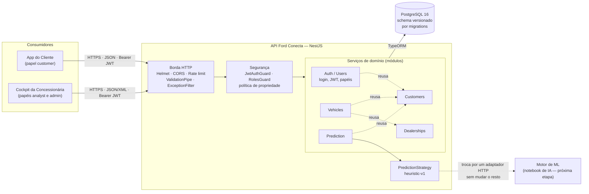
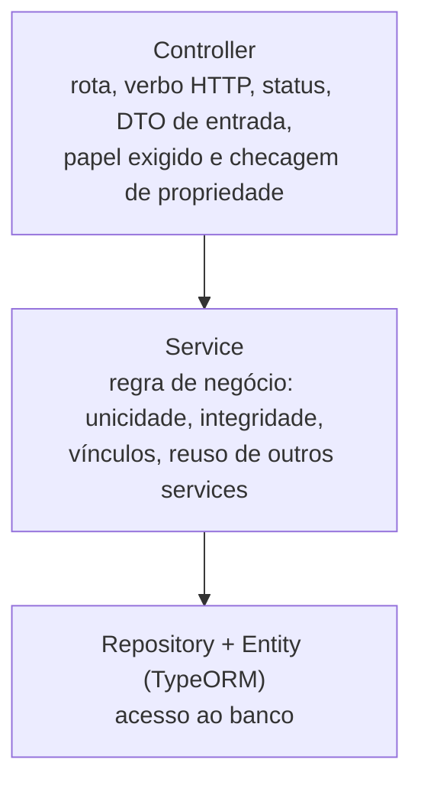
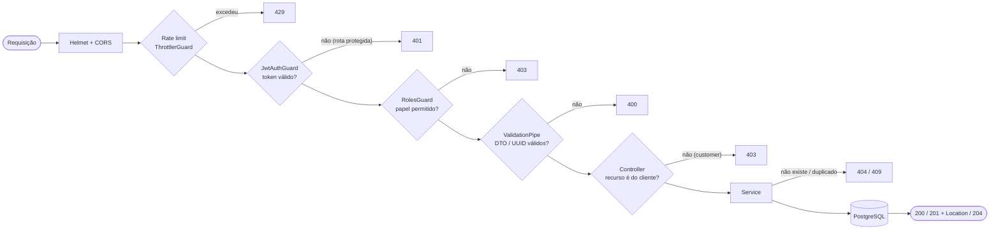
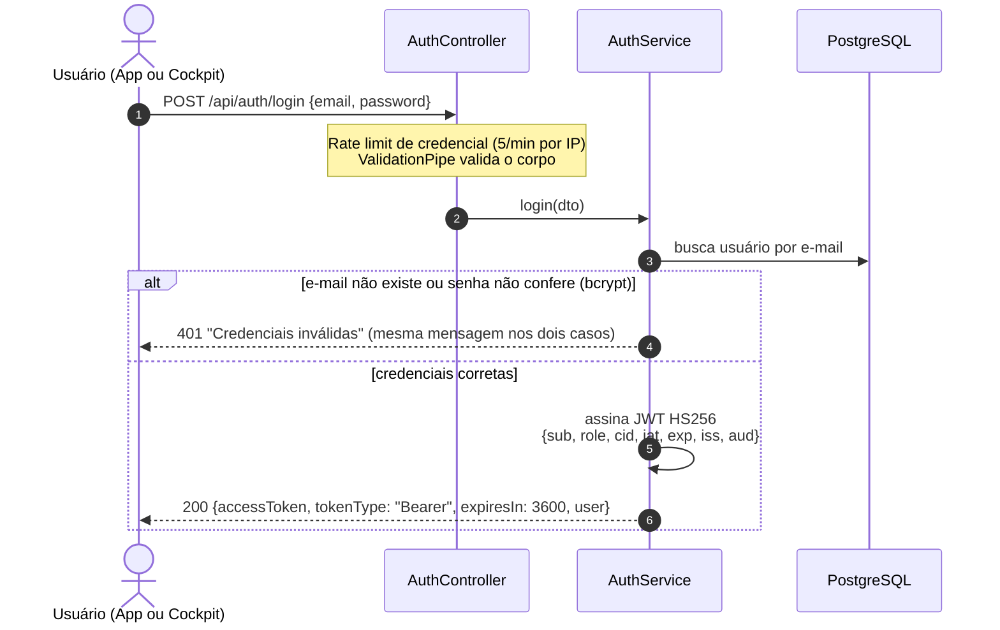
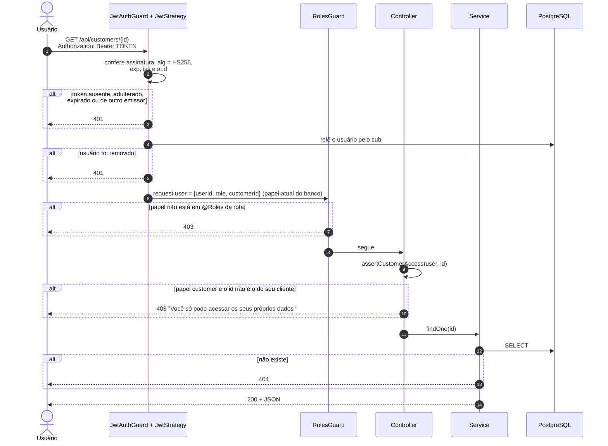
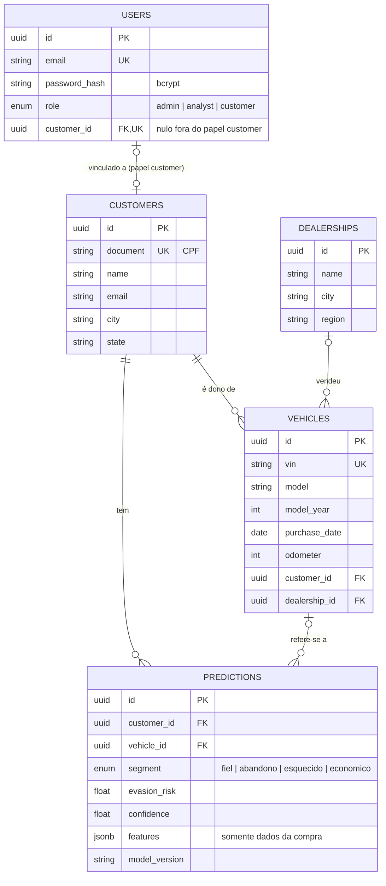

# Ford Conecta — Arquitetura da Camada de Serviços

Este documento descreve a API REST do **Ford Conecta** (Desafio 02, Ford FIAP 2026): os
componentes e suas responsabilidades, como uma requisição atravessa a aplicação, como
funcionam a autenticação e a autorização, e o modelo de dados.

Os diagramas estão em Mermaid e são renderizados direto no GitHub.

---

## 1. Visão geral

O Ford Conecta ataca o **VIN Share**: a porcentagem de veículos Ford que continuam fazendo
manutenção na rede oficial. A API é o back-end que atende três consumidores:

- o **App do Cliente**, usado pelo dono do veículo;
- o **Cockpit da Concessionária**, usado pelo time de pós-venda, que vê a lista de clientes
  em risco de evasão;
- o **Motor de ML**, que classifica o cliente no momento da compra. Na API ele fica atrás da
  interface `PredictionStrategy`.

---

## 2. Componentes e responsabilidades

| Componente | Responsabilidade | Onde está |
|---|---|---|
| Borda HTTP | Cabeçalhos de segurança (Helmet), CORS restrito, rate limit global e no login, validação e sanitização da entrada, formato único de erro | [`app.setup.ts`](../src/app.setup.ts), [`app.module.ts`](../src/app.module.ts), [`all-exceptions.filter.ts`](../src/common/filters/all-exceptions.filter.ts) |
| Segurança | Autentica o JWT, confere o papel exigido pela rota e garante que um customer só acesse os próprios dados | [`modules/auth/guards`](../src/modules/auth/guards), [`customer-access.policy.ts`](../src/modules/auth/policies/customer-access.policy.ts) |
| Auth / Users | Cadastro, login e emissão do JWT; administração de usuários e do vínculo usuário ↔ cliente | [`modules/auth`](../src/modules/auth) |
| Customers | Cadastro de clientes (donos de veículos) | [`modules/customers`](../src/modules/customers) |
| Vehicles | Veículos por VIN, com representação JSON ou XML; sub-recurso `/customers/:id/vehicles` | [`modules/vehicles`](../src/modules/vehicles) |
| Dealerships | Concessionárias da rede oficial | [`modules/dealerships`](../src/modules/dealerships) |
| Prediction | Perfil do cliente e risco de evasão a partir de dados da compra; lista de risco do Cockpit | [`modules/prediction`](../src/modules/prediction) |
| PredictionStrategy | Contrato do motor de predição. Hoje é uma heurística explicável; o modelo treinado entra trocando uma linha em `prediction.module.ts` | [`strategies/`](../src/modules/prediction/strategies) |
| PostgreSQL | Persistência. O schema só muda por migration versionada (`synchronize` desligado) | [`database/migrations`](../src/database/migrations) |

### 2.1 Camadas dentro de cada serviço

Cada módulo em `src/modules/*` é um serviço autocontido, com as mesmas três camadas. A
dependência só aponta para baixo:

- **Controllers** não acessam o banco e não contêm regra de negócio.
- **Services** não sabem nada de HTTP, a não ser pelas exceções do Nest que o filtro global
  converte em status.
- Um service pode reusar outro por injeção de dependência. Por exemplo, `VehiclesService` usa
  `CustomersService` para garantir que o dono existe, sem acessar a tabela de outro módulo.

---

## 3. Caminho de uma requisição

A mesma sequência vale para toda rota. Qualquer exceção, em qualquer etapa, cai no
`AllExceptionsFilter` e sai no envelope padrão de erro.

Rotas públicas (`/health`, `/api/auth/register`, `/api/auth/login`) não passam pelos guards de
JWT e de papel. O rate limit vale para todas, e as duas rotas de credencial têm um limite
próprio, mais baixo.

---

## 4. Autenticação

### 4.1 Login e emissão do token

### 4.2 Requisição protegida

### 4.3 O token

| Claim | Conteúdo | Uso |
|---|---|---|
| `sub` | id do usuário | Identifica quem faz a requisição; a estratégia relê o usuário por ele |
| `role` | `admin`, `analyst` ou `customer` | O cliente (App/Cockpit) usa para montar a interface |
| `cid` | id do cliente vinculado, ou `null` | O App usa para chamar `/customers/{cid}/vehicles` |
| `iat` / `exp` | emissão e expiração | Validade de **1 hora** (`JWT_EXPIRES_IN`) |
| `iss` / `aud` | `ford-conecta-api` / `ford-conecta-clients` | Rejeita tokens emitidos por outro sistema ou para outro destino |

O que a API valida em todo token:

1. **Assinatura HMAC-SHA256** com `JWT_SECRET`. A API não sobe sem o segredo, e ele precisa ter
   pelo menos 32 caracteres ([`jwt.config.ts`](../src/config/jwt.config.ts)).
2. **Algoritmo fixo em HS256**, o que bloqueia `alg: none` e a troca de algoritmo.
3. **Expiração** (`exp`), **emissor** (`iss`) e **audiência** (`aud`).
4. **Usuário ainda existe.** A decisão de acesso usa o papel e o vínculo **atuais** do banco,
   não os do token. Rebaixar um usuário ou removê-lo vale na hora, sem esperar o token expirar.

O token não carrega e-mail, nome nem nenhum dado pessoal. Os testes em
[`test/jwt.e2e-spec.ts`](../test/jwt.e2e-spec.ts) cobrem cada uma dessas validações.

---

## 5. Autorização: perfis e permissões

| Papel | Quem é | Enxerga |
|---|---|---|
| `admin` | Administrador da plataforma | Tudo, inclusive a gestão de usuários |
| `analyst` | Time de pós-venda da concessionária (Cockpit) | Toda a carteira de clientes, veículos e predições; não remove registros nem administra usuários |
| `customer` | Dono do veículo (App) | Só o próprio cadastro e os próprios veículos; não vê predições (risco de evasão é dado interno) |

A autorização acontece em dois níveis:

- **Por papel (RBAC):** o decorator `@Roles()` declara quem pode chamar a rota, e o `RolesGuard`
  aplica a regra.
- **Por propriedade do recurso:** `assertCustomerAccess` impede que um customer leia o cliente
  ou o veículo de outra pessoa trocando o id na URL (OWASP API1, *Broken Object Level
  Authorization*).

| Rota | admin | analyst | customer |
|---|:---:|:---:|:---:|
| `GET /health` · `POST /auth/register` · `POST /auth/login` | público | público | público |
| `GET /auth/me` | ✅ | ✅ | ✅ |
| `GET /users` · `GET /users/:id` · `PATCH /users/:id` | ✅ | ❌ | ❌ |
| `GET /customers` | ✅ | ✅ | ❌ |
| `GET /customers/me` | ❌ | ❌ | ✅ |
| `GET /customers/:id` · `GET /customers/:id/vehicles` | ✅ | ✅ | só o próprio |
| `POST /customers` · `PATCH /customers/:id` | ✅ | ✅ | ❌ |
| `DELETE /customers/:id` | ✅ | ❌ | ❌ |
| `GET /vehicles` | ✅ | ✅ | ❌ |
| `GET /vehicles/:id` | ✅ | ✅ | só os próprios |
| `POST /vehicles` · `PATCH /vehicles/:id` | ✅ | ✅ | ❌ |
| `DELETE /vehicles/:id` | ✅ | ❌ | ❌ |
| `GET /dealerships` · `GET /dealerships/:id` | ✅ | ✅ | ✅ |
| `POST` · `PATCH` · `DELETE /dealerships` | ✅ | ❌ | ❌ |
| `/predictions` · `/customers/:id/predictions` | ✅ | ✅ | ❌ |

A matriz inteira é executada como teste em
[`test/authorization.e2e-spec.ts`](../test/authorization.e2e-spec.ts).

### Como uma conta do App vira dona de um cadastro

O auto-cadastro (`POST /auth/register`) sempre cria um usuário `customer` **sem vínculo**. Quem
liga a conta ao cadastro do cliente é um admin, com `PATCH /users/:id {"customerId": ...}`.

O vínculo não é feito por e-mail de propósito. Como o e-mail do cadastro não é verificado,
qualquer pessoa poderia se registrar com o e-mail de outra e herdar os dados dela. Cada cliente
pertence a no máximo um usuário (índice único em `users.customer_id`).

---

## 6. REST nível 2

- **Recursos com URL própria:** `/customers/{id}`, `/vehicles/{id}`, `/predictions/{id}`. Os
  relacionamentos viram sub-recursos: `/customers/{id}/vehicles` e `/customers/{id}/predictions`.
- **Verbos com o significado HTTP:**
  - `GET` lê e é idempotente;
  - `POST` cria e responde `201` com o header `Location` apontando para o novo recurso;
  - `PATCH` atualiza só os campos enviados;
  - `DELETE` remove e responde `204` sem corpo.
- **Uma URL, várias representações:** `GET /vehicles/{id}` devolve JSON por padrão e XML com
  `Accept: application/xml`. Um formato não suportado recebe `406`, e a resposta traz
  `Vary: Accept`.
- **Status coerentes:**

| Status | Quando |
|---|---|
| `200 OK` | Leitura ou atualização |
| `201 Created` + `Location` | Criação de recurso |
| `204 No Content` | Remoção |
| `400 Bad Request` | Corpo, query ou UUID inválidos; campo fora do contrato |
| `401 Unauthorized` | Token ausente, inválido, expirado ou de usuário removido; credenciais erradas |
| `403 Forbidden` | Papel sem permissão, ou recurso de outro cliente |
| `404 Not Found` | Recurso ou rota inexistente |
| `406 Not Acceptable` | Formato do `Accept` não suportado |
| `409 Conflict` | CPF, VIN ou e-mail duplicados; cliente já vinculado a outro usuário |
| `429 Too Many Requests` | Rate limit (com header `Retry-After`) |
| `503 Service Unavailable` | `/health` com o banco fora do ar |

---

## 7. Modelo de dados

O schema evolui só por migration: `InitialSchema` cria as tabelas e `LinkUserToCustomer`
adiciona o vínculo usuário ↔ cliente. Os testes e2e apagam o banco de teste e rodam todas as
migrations do zero a cada arquivo, então as migrations também são testadas.

---

## 8. Decisões de projeto

| Decisão | Por quê |
|---|---|
| Relê o usuário no banco a cada requisição | Rebaixamento e remoção valem na hora. O custo é uma consulta por chave primária. |
| `403` (e não `404`) para o recurso de outro cliente | É a resposta semanticamente correta para "existe, mas não é seu". Em `/customers/:id` e nos sub-recursos, a checagem roda **antes** da busca, então a resposta é a mesma exista o id ou não. Em `/vehicles/:id` é preciso carregar o veículo para saber o dono; como os ids são UUID v4 aleatórios, a diferença entre `403` e `404` não permite enumerar veículos. |
| Vínculo usuário ↔ cliente feito pelo admin | O e-mail do auto-cadastro não é verificado (ver seção 5). |
| Predição fora do alcance do customer | O risco de evasão é informação comercial interna da concessionária. |
| Features de comportamento futuro são rejeitadas com `400` | O `ValidationPipe` com `forbidNonWhitelisted` impede *data leakage* no motor de ML: só entra o que existe no momento da compra. |
| Violação de índice único vira `409` no filtro | Se duas requisições passarem juntas pela checagem de duplicidade, o banco barra e o cliente recebe `409`, não `500`. |
